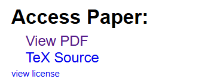

arXivからとってきたTeXのtar.gzから，HTMLを生成して GitHub Pages から簡単に見るためのツール というかリポジトリ．

macで動作確認．windows, linuxでも動くはず（未確認）

*なんのために？*
- ブラウザの翻訳拡張機能をつかって快適に読みたい．
- というかPLaMo翻訳拡張機能が使いたい．
- `make4ht`で変換したあとHTMLを開くのがめんどい．
- PLaMo翻訳の拡張機能がローカルHTMLに対応していなくて，どっかに公開してからアクセスできるようにしたい．
- arxivからとってきたtar.gzポン置きで勝手にやってほしい

## 依存関係
- Rust
- rust-script
- cargo-make
- texlive

特に，texliveまわりは色々エラーが出るかもしれない．そのときは生成AIに聞いてどうにかしてほしい．texliveの困りポイントは対応しきれないので．

Rustのインストール: https://rust-lang.org/ja/tools/install/

rust-scriptのインストール: 
```bash
cargo install rust-script
```
公式サイト：https://rust-script.org/

cargo-makeのインストール: 
```bash
cargo install cargo-make
```
https://github.com/sagiegurari/cargo-make

texliveのインストール: 各々調べてほしい．


## 使い方
1. arXivとかからTeXのtar.gzをダウンロードしてくる．
2. `cargo make build`を実行する．
3. `dist/<filename>/index.html`が生成される．ブラウザで開いてみる．
4. 自分のところでgithub pagesを設定していれば，pushする．公開される．

### step0
必要な依存関係をインストール

依存関係が足りているか，次のコマンドで確認できる．エラーが出なければOK．
ただしtexliveは除く．
```bash
cargo make check
```

### step1


ここから，該当論文のTeXソース(.tar.gz形式)をダウンロードする．

### step2
ダウンロードした`tar.gz`を, `sources/`に移動する．

### step3
`cargo make build`を実行する．
`dist/<filename>/index.html`が生成される．

### step4
git pushする.

## 対応しているTeX文書構造
エントリポイントが次のもの．
- main.tex
- `<hoge>.tar.gz`のとき，`<hoge>.tex`があるときはそれをエントリポイントとする．

## 未確認事項
リポジトリをforkしたあと，Pagesデプロイ機能がそのままでちゃんと動くかは確認していない．

## 困ったら
私に適当に聞いてくれれば，texliveのエラー以外は対応する．

## Q&A
- Q: なんでローカルで変換してpushするの？ Actionsで変換すればよくない？
- A: texliveがデカ過ぎ．フルインストールで6GBとかの怪物を，Actionsのランナーでインストールして動かして...って流石に時間とコストに見合わない．


## その他
Rust好きなのでRustでスクリプトも書いています．
それにどのOS(windos, linux, mac)でも動かせるし．
